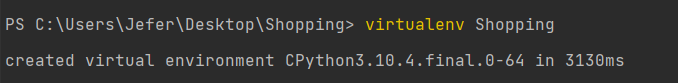
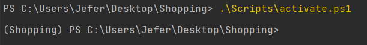
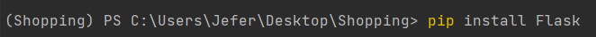
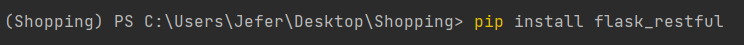
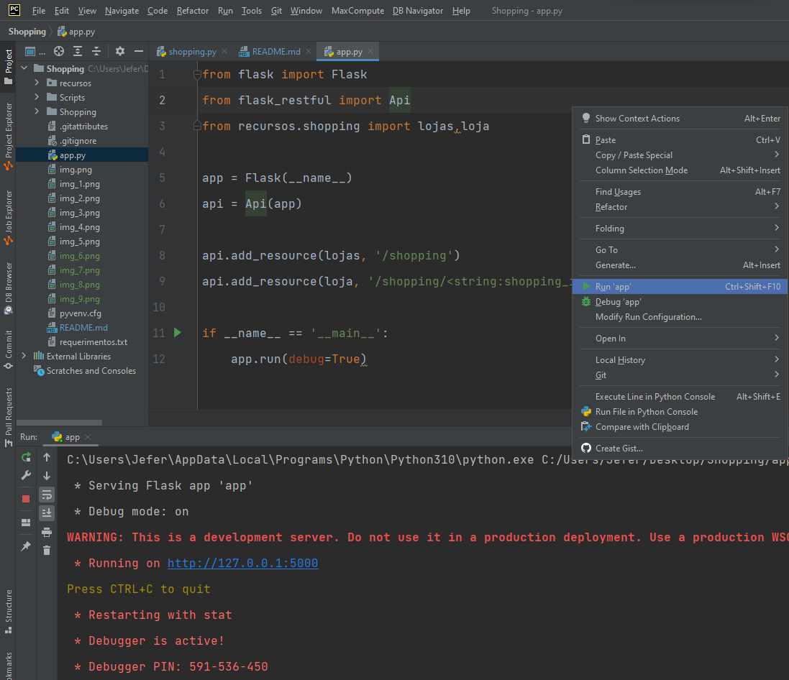
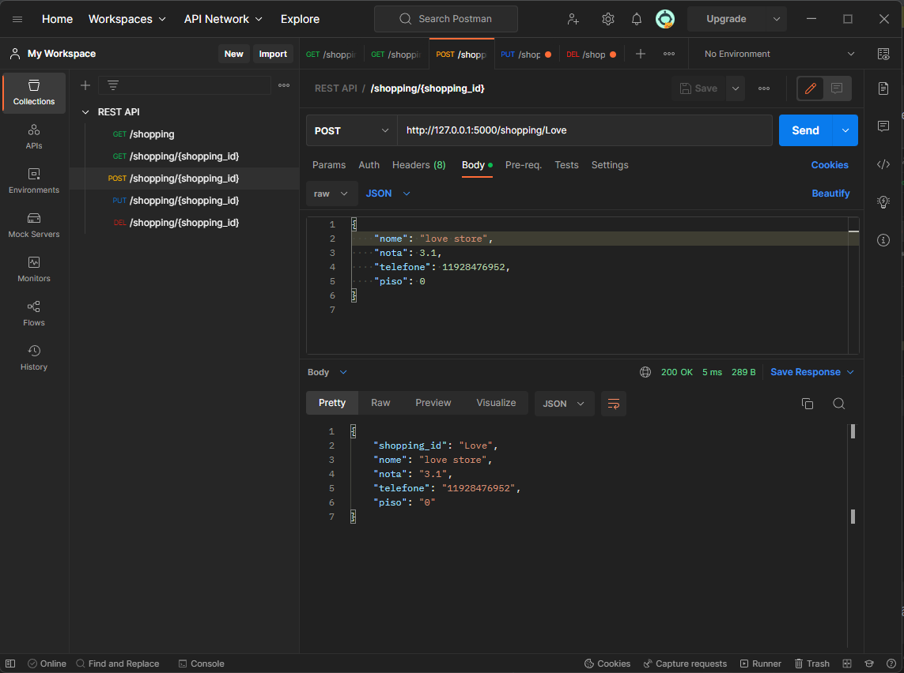
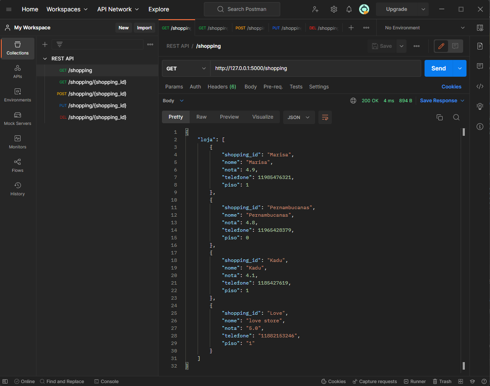
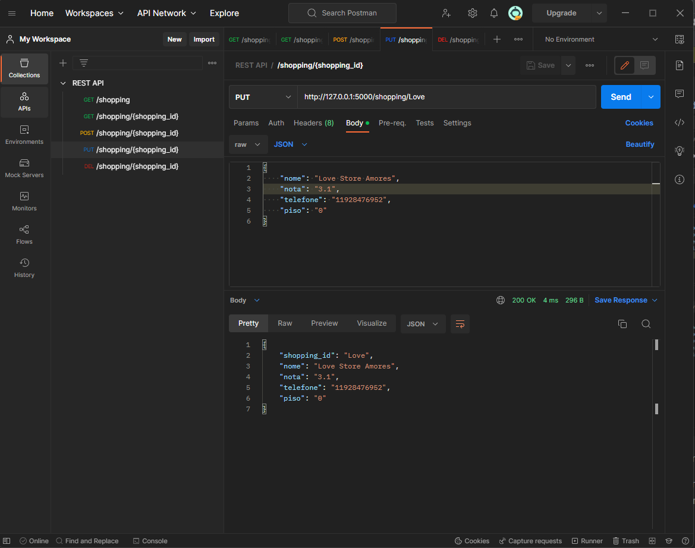
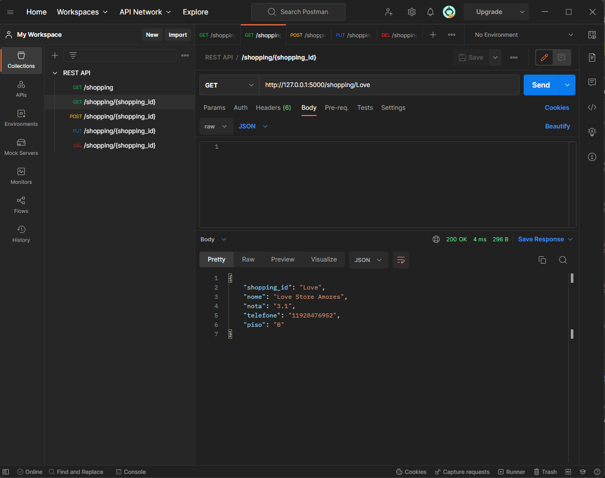
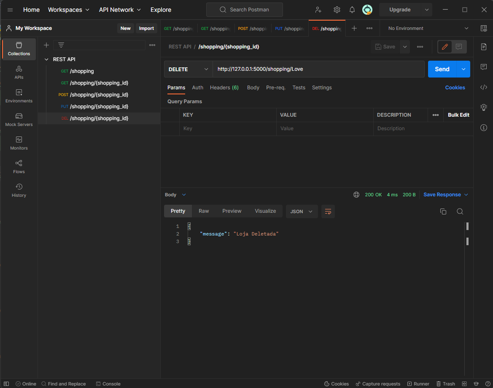

# Shopping

# 💻Sobre o projeto
Uma API para lojas de um Shopping {Linguagem ultilizada: REST APIs com Python, Flask e Postman uma plataforma de API }.

# Como funciona o Projeto
Projeto tem como objetivo o usuário fazer um CRUD na API (Criar, Ler, Alterar, Deletar).

# Ambiente.
Pycharm, Postman

Após a instalação precisamos criar o ambiente virtual com o seguinte comando.

Agora vamos ativar nosso ambiente virtual com o seguinte comando

Perceba que o código esta em amarelo. Após o enter ele ativa nosso ambiente virtual perceba que agora na linha de baixa começa com (Shopping).

Para que o programa rode é necessário fazer a instalação de algumas requisições:

 
# 🔥Executando o Projeto Localmente:

Basta executar o arquivo app.py dentro mesmo do Pycharm como segue na imagem

Usando as configurações do Postman com nosso IP: http://127.0.0.1:5000/shopping
Podemos consultar quais lojas do shopping que temos em nosso sistema. Segue a imagem

Vamos adicionar uma nova loja para o nosso shopping bastar ir na função POST, perceba a imagem a baixo que ja foi adicionada.

vamos consultar se foi criado no nosso sistema

Caso você tenha errado e precise alterar, vamos a função PUT, como vocês podem observar a palavra "Love Store Amores" foi adicionada ao nome.

Agora vamos verificar em especifico a loja, especificando pelo nome do id da loja, também na função GET.

E por fim vamos excluir uma academia

Agora vamos para o GET consultar se foi de fato excluida a loja

e por fim nosso sistema ficou assim.

